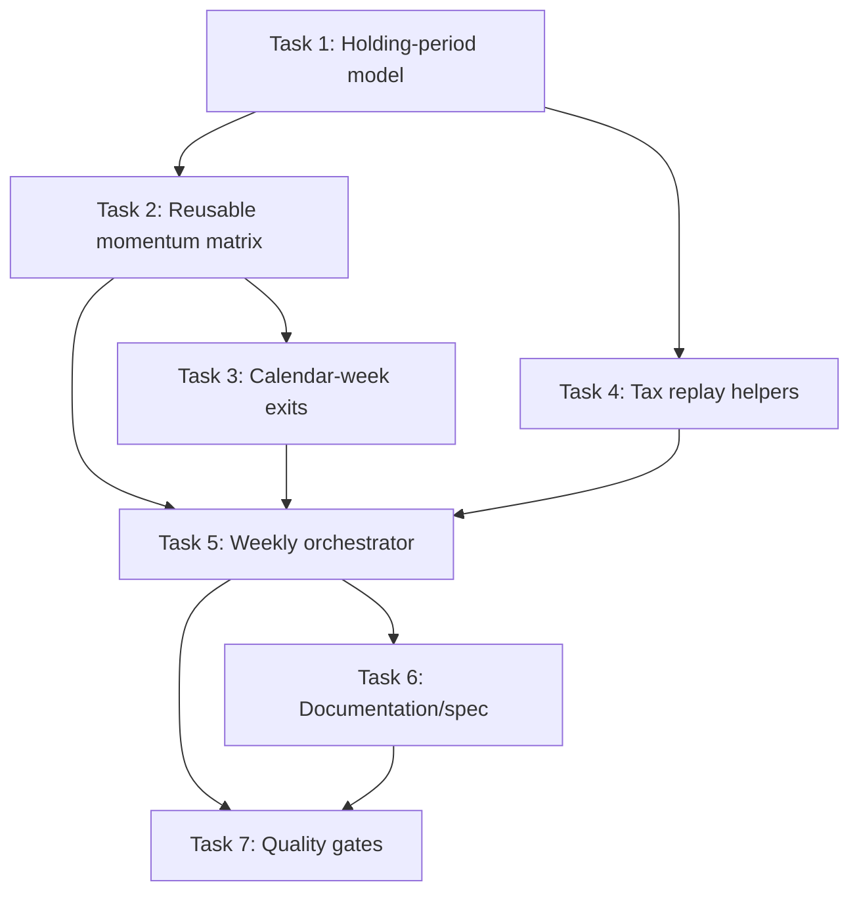

Status: complete
Last Updated: 2026-07-13

## 1. Summary

Implement a resumable 1–52 calendar-week holding-period matrix for the existing point-in-time S&P 500 monthly-entry momentum research workflow. The implementation will preserve the current monthly workflow, add explicit weekly-holding configuration, evaluate all registered rules/stops/days/Top-N values, and rank tax-reinvestment results by fully taxed XIRR.

## 2. Technical Decisions

| Decision | Choice | Rationale |
|---|---|---|
| Project standards | `pathlib`, typed Python, `unittest`, CLI JSON, atomic/idempotent outputs | Required by `AGENTS.md` and the project constitution. |
| Exit timing | Calendar weeks; first market session on/after `entry + weeks × 7 days` | Matches the completed feature specification. |
| Point-in-time data | Reuse the current DuckDB membership, alias, tenure, and exception workflow | Preserves established anti-look-ahead safeguards. |
| Architecture | Extract reusable matrix/replay functions first; retain scripts as backward-compatible CLI wrappers | Enables one weekly orchestrator without subprocess coupling and makes the logic testable. |
| Winner artifact layout | Hierarchical group folders under `reports/weekly_holding_period_matrix/groups/week_XX/<rule>/<stop>/` | Keeps group winners inspectable without creating artifacts for every configuration. |
| Verification | Unit tests plus a small DuckDB/CSV integration smoke test | Covers date/ranking logic and the end-to-end point-in-time workflow. |

## 3. Affected Modules

| Module | Impact | New/Modified |
|---|---|---|
| `scripts/run_monthly_momentum_lot_matrix.py` | Add a weekly-holding option without changing existing month-based behavior. | Modified |
| `src/quantresearch/research/tax_reinvestment.py` | Support a holding-period maturity convention appropriate to calendar weeks. | Modified |
| `scripts/run_tax_reinvestment_matrix.py` | Pass weekly holding metadata/configuration to the replay. | Modified |
| `scripts/run_weekly_holding_period_matrix.py` | Orchestrate the resumable 1–52-week matrix and publish summaries/winners. | New |
| `tests/` | Add unit and CLI/smoke coverage for weekly maturity, ranking, and resume behavior. | Modified/New |
| `specs/002-adaptive-strategy-research/spec.md` | Trace the approved weekly research capability to the formal project spec. | Modified |

## 4. Task Breakdown

### Task 1: Add generic holding-period configuration and maturity calculation

- **Module:** `src/quantresearch/research/tax_reinvestment.py`
- **Type:** Modification
- **Description:** Represent scheduled holding periods as months or calendar weeks; calculate original maturity without conflating weekly and monthly purchase cycles.
- **Depends on:** None
- **Acceptance:** Existing monthly maturity tests remain unchanged; new tests prove a weekly lot matures at the first applicable purchase/reinvestment point after its calendar-week exit convention.

### Task 2: Extract reusable point-in-time momentum matrix execution

- **Module:** `src/quantresearch/research/monthly_momentum_lots.py`, `scripts/run_monthly_momentum_lot_matrix.py`
- **Type:** New functions and modification
- **Description:** Move configuration validation, matrix execution, and publication-ready result construction from the script into typed library functions while preserving the current monthly CLI contract.
- **Depends on:** Task 1
- **Acceptance:** Existing monthly CLI output remains logically equivalent for the default 12-month configuration; focused tests exercise reusable functions without a subprocess.

### Task 3: Add calendar-week exit support to the momentum matrix

- **Module:** `src/quantresearch/research/monthly_momentum_lots.py`, `scripts/run_monthly_momentum_lot_matrix.py`
- **Type:** Modification
- **Description:** Add validated mutually exclusive month/week holding options; use the first trading session on or after `execution_date + weeks × 7 days`, with existing conservative stop-first behavior.
- **Depends on:** Task 2
- **Acceptance:** Unit and DuckDB fixture tests verify 1-week and 52-week targets, holiday handling, no future-data leakage, and unchanged monthly behavior.

### Task 4: Extract reusable tax-reinvestment summary and winner publication

- **Module:** `src/quantresearch/research/tax_reinvestment.py`, `scripts/run_tax_reinvestment_matrix.py`
- **Type:** Modification
- **Description:** Expose typed grouping/ranking/publication helpers so a caller can rank by fully taxed XIRR and selectively retain detailed winner evidence.
- **Depends on:** Task 1
- **Acceptance:** Existing tax CLI remains compatible; tests prove XIRR-first/wealth-second ordering and correct open-lot treatment.

### Task 5: Implement resumable weekly matrix orchestrator

- **Module:** `scripts/run_weekly_holding_period_matrix.py`
- **Type:** New file
- **Description:** Iterate weeks 1–52, all rules, four stop levels, entry days, and Top 1–5; publish all summary rows, selected group winners, a global winner, JSON assumptions, and failure/resume state.
- **Depends on:** Tasks 2, 3, and 4
- **Acceptance:** A bounded matrix completes from fixtures, skips only complete group summaries on resume, preserves incomplete artifacts, records a simulated group failure, and produces deterministic ranking.

### Task 6: Update formal specification and research documentation

- **Module:** `specs/002-adaptive-strategy-research/spec.md`, `docs/`
- **Type:** Modification/New file
- **Description:** Trace the weekly capability, CLI, output hierarchy, anti-look-ahead constraints, and full-run versus smoke-run workflow.
- **Depends on:** Task 5
- **Acceptance:** Documentation has exact commands and clearly labels full-study results as in-sample research rather than a live recommendation.

### Task 7: Run quality gates and bounded validation

- **Module:** `tests/`, project root commands
- **Type:** Test/Validation
- **Description:** Execute focused unit tests, bounded integration smoke test, full suite, `quantresearch doctor`, and `git diff --check`.
- **Depends on:** Tasks 1–6
- **Acceptance:** All automated checks pass; the bounded smoke run produces reviewable outputs without touching raw data.

## 4.1 Execution Blueprint

1. **Task 1:** Extend `TaxReinvestmentConfig` with one validated month-or-week choice and a typed maturity-date helper. Preserve existing monthly callers; use the helper only for early-exit spreading.
2. **Task 2:** Add typed `MatrixConfig`, `MatrixResult`, `run_momentum_lot_matrix(config)`, and atomic writers in `src/quantresearch/research/monthly_momentum_lots.py`; retain the existing script as a CLI wrapper.
3. **Task 3:** Add mutually exclusive `--holding-months` and `--holding-weeks`. Resolve weekly maturity with parameterized DuckDB arithmetic and the first eligible session; preserve conservative stop-first ordering.
4. **Task 4:** Add typed tax-summary, XIRR-first ranking, and selected-winner publication helpers. Undefined XIRR is explicitly reported; tie-break on fully taxed wealth and stable identifiers.
5. **Task 5:** Add `WeeklyHoldingMatrixConfig` plus `run_weekly_holding_matrix(config)` in a reusable module and a thin CLI script. Accept `--weeks-start`, `--weeks-end`, and `--resume`; completion requires fingerprinted `group_result.json` plus group summary CSV. Recoverable errors go to `failures.csv`; continue, then exit `1` if any failure occurred.
6. **Task 6:** Update numbered spec 002 and add `docs/weekly_holding_period_backtest.md` with output hierarchy, smoke command, full command, and in-sample warning.
7. **Task 7:** Use direct `unittest` tests for domain functions and a temporary DuckDB/CSV fixture for weekly exit, resume, publication, and point-in-time behavior.

## 5. Dependency Graph

## 6. New Dependencies

No new dependencies expected.

## 7. Configuration Changes

- `--holding-weeks`: positive integer, mutually exclusive with `--holding-months`.
- `--weeks-start` / `--weeks-end`: bounded range for smoke runs or continuation.
- `--resume`: skip only groups with a validated completed summary.
- Existing `--rule`, `--stop`, `--output`, membership, and exception options remain available.

## 8. Testing Strategy

| Test Type | Scope | Location |
|---|---|---|
| Unit | Holding-period validation, calendar-week target dates, XIRR/wealth ordering, resume-state checks | `tests/test_*weekly*.py`, `tests/test_tax_reinvestment.py` |
| Integration | Small DuckDB/CSV point-in-time fixture with weekly exits and selected winner artifacts | `tests/test_*weekly*.py` |
| Regression | Existing month-based matrix and tax-reinvestment behavior | Existing test suite |

## 9. Rollout & Validation

Run focused tests, the full suite, `git diff --check`, and a small bounded weekly smoke matrix before a full 1–52-week run.

## 10. Open Risks

- A full 52-week × rules × stops × entry-day × Top-N matrix is computationally expensive; orchestration must avoid retaining every detailed trade file.
- Tax-reinvestment ranking must remain deterministic and use only point-in-time information.
